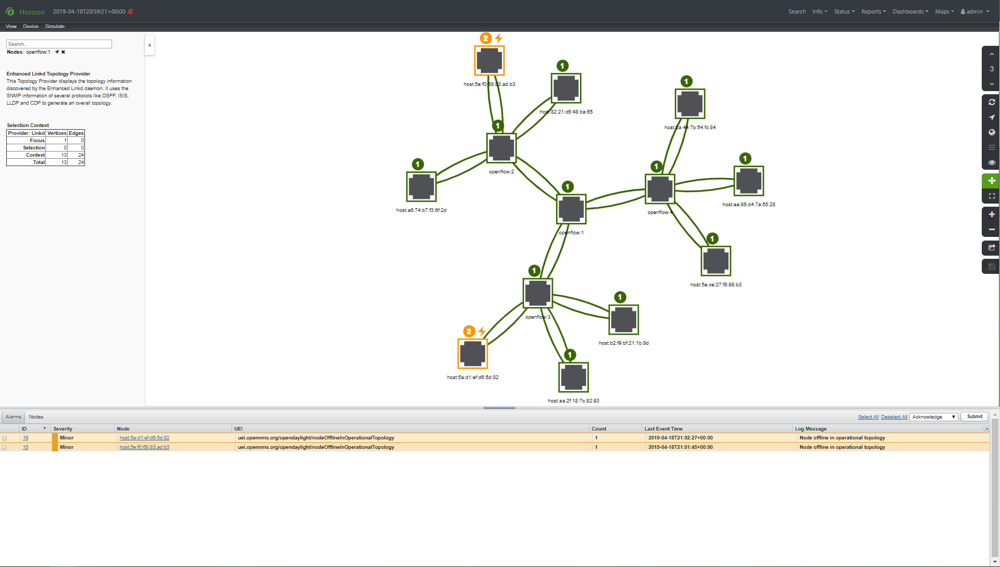

# OpenNMS Opendaylight Plugin

## Overview

This plugin adds the ability for OpenNMS to monitor devices and networks managed by Opendaylight controllers to OpenNMS.

We currently support:
 * Importing inventory from the operational topology
 * Triggering faults (alarms) when a devices disapears from the operational topology
 * Collecting and graphing performance metrics
 * Visualizing the network topology



## Requirements

* OpenNMS Horizon 24.0.0 or greater

* Opendaylight Oxygen-SR4

## Getting Started

See [the walkthrough](WALKTHROUGH.adoc) for instructions on getting started.

## Build & install

Build and install the plugin into your local Maven repository using:
```
mvn clean install
```

From the OpenNMS Karaf shell:
```
feature:repo-add mvn:org.opennms.plugins.odl/odl-karaf-features/1.0.0-SNAPSHOT/xml
config:edit org.opennms.plugins.opendaylight
property-set controllerUrl http://opendaylight:8181
config:update
feature:install opennms-plugins-odl
```

Update automatically:
```
bundle:watch *
```
